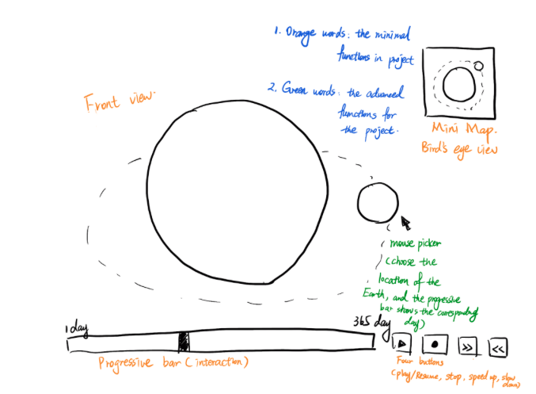

# Graphics-project Team 8: Jiangyun Wang, Fangji Xu, Liangmou Zhang
Our team will work on creating an animation to show the revolution of the Earth around the Sun as well as the rotation of themselves for this project

   

Here is a draft for our program. In this canvas, we have two 3D geometric shapes: two spheres. The small sphere is the Earth, it rotates itself and goes around the big sphere, which is the Sun, follow by the orbit. The big sphere(Sun) also rotates itself.
 
The other canvas, which is at top right, is a mini map. It is the bird’s eye view of the rotation and revolution.
 
We have a progressive bar for User interaction and tracing the animation. The animation displays the rotation and revolution for 365 days. Users are able to drag the progressive bar. There are some buttons for users to control the animation: play/pause, stop, speed up and slow down.

For the minimum set of requirements, we have some thoughts.
-   	One canvas: We have a canvas HTML element to render the 3D world.
-   	Two 3D geometric shapes: we have two spheres to represent the Earth and the Sun
-   	One perspective projection: The main canvas presents the perspective projection of two stars.
-   	One camera: we are going to have two cameras for the main canvas and another one for the min map.
-   	Two 3D mesh objects: we plan to have two files that includes the basic information of the shapes. Our application will read files and draw the shapes onto the canvas
-   	One lighting source: The Sun will have lighting as spot lightning. Also if we are going to have a galaxy as the background and stars around, the stars will also contains lighting as point lightning.
-   	Two textures: Will have textures for the Sun and Earth. We will have two jpg, other extensions, as separate files and load them to our program
-   	Two user interactions: The progressive bar is the first user interaction which allows user to track the animation. There are some buttons on the right which allows users to play, pause, speed up and slow up the animation. In addition, we are thinking to engage mouse trackball so that users are able to view from different perspectives.

For additional requirements, we are thinking:
-   	Additional canvases: we implement a mini map at the top right
-   	Shadows: There could be some shadows on the opposite side of Earth when it goes around the Sun. Shadow is a reasonable addition for our projection, but we are not sure how to calculate the area of shadows.
-   	Bump Maps: We think we may implement bump map on the Earth.
-   	Reflections: Not sure how to implement it in our project
-   	Orthographic projections: The mini map shows both Stars’ corresponding orthographic projections to the animation from the bird’s eye view
-   	Curves: We probably won’t do this in our project based on our current design.
-   	Surfaces: We haven’t had any ideas of introducing surfaces to our project.
-   	Animations: this is the must-do additional requirement for our project because our project is an animation of revolution and rotation. The animation of the Earth follows a path, the orbit. Moreover, it animates rotation. Our project supports play and stop with corresponding UI control by the buttons at the bottom right
-   	Picking: We are thinking to have the mouse picker for the Earth so that users can choose the location of it and then the progressive bar would show the corresponding day. But this is what we want to extend for this project.
-   	Textures: Based on our current design, we only need two textures for two spheres. It doesn't make sense to change the textures of them rationally.

